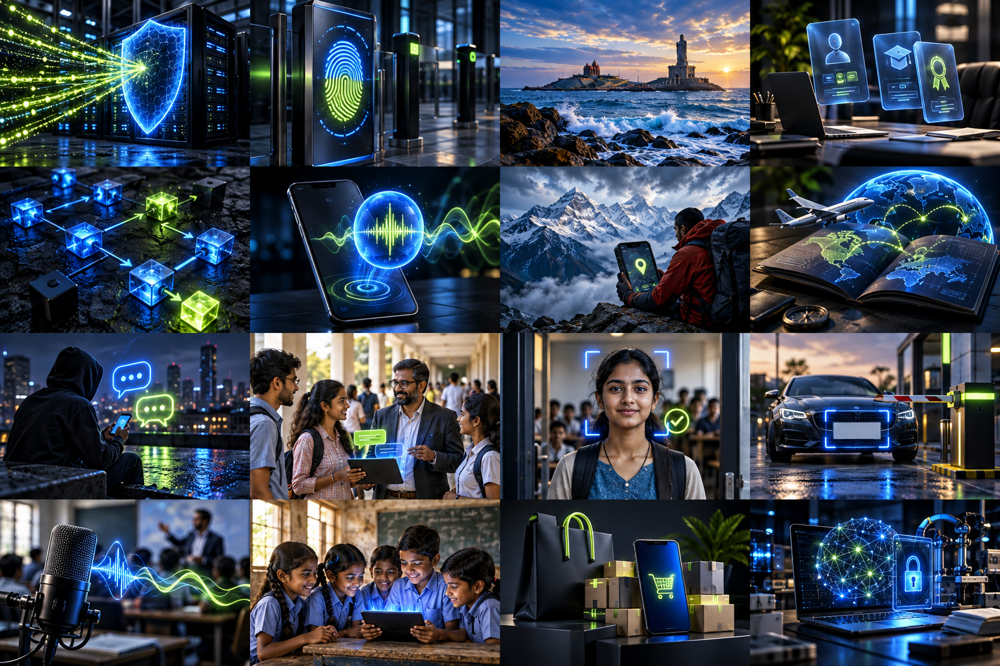

# Hi, I’m Shushaanth S
### Cybersecurity · Python Backends · Full Stack Development

I turn technical ideas into systems I can inspect, test and improve.

[Portfolio](https://shushaanth-portfolio.vercel.app/) · [LinkedIn](https://www.linkedin.com/in/shushaanth-stephen-7bb498288/) · [Email](mailto:shushaanth25@gmail.com)

## Security meets software

I’m a final-year **Cyber Security Engineering** student at **Paavai Engineering College**, graduating in **2027**, and a **Full Stack Development learner at NxtWave**.

My work connects Linux network defense, Python backends, React interfaces and AI-assisted workflows. I’m open to internships in cybersecurity, backend development and full-stack engineering.

## Selected work

[Explore all 16 project stories →](https://shushaanth-portfolio.vercel.app/#work)

[Portfolio source](https://github.com/NACENNOZRO/shushaanth-portfolio)

| Project | What I’m working on |
| --- | --- |
| **dProtect** | Controlled multi-VM DDoS defense using Nginx, Linux firewalls and Suricata; parallel filtering and rotation |
| [**KanyaConnect**](https://github.com/NACENNOZRO/Kanya-connect) | Inclusive tourism interfaces and AI-assisted guidance for Kanyakumari |
| **Skillrel** | React frontend work for student–recruiter skill and certification credibility |
| **AI Workflow Automation** | Coordinating task inputs, decisions and API-driven actions |
| **Zero Trust Gateway** | Device fingerprinting, contextual risk and conditional access design |
| [**TARA AI**](https://github.com/NACENNOZRO/TARA-AI) | Kotlin Android assistant with model providers, voice commands, reminders and integration settings |
| [**NepalSafe**](https://github.com/NACENNOZRO/NepalSafe-Unified) | Android safety dashboard, mesh SOS and a Python image-analysis backend; available source and validation notes |
| [**AI Travel Planner**](https://github.com/NACENNOZRO/travel) | React/FastAPI travel, budget and weather workflows |

| [**Nova Mart**](https://github.com/NACENNOZRO/nova-mart) | Animated ecommerce frontend with product filters and cart interactions |\n\n

## My toolkit

| Area | Practical tools and foundations |
| --- | --- |
| **Network defense** | Linux, Nginx, Suricata, UFW, iptables, traffic inspection, logging |
| **Development** | Python, FastAPI, React, JavaScript, HTML/CSS, Tailwind CSS, REST APIs |
| **Workflow & systems** | Git/GitHub, API integration, SQL fundamentals, troubleshooting |
| **Exploration** | OpenCV, EasyOCR, ML foundations, Zero Trust, AI providers and local models |

I distinguish hands-on project experience from concepts I’m still learning. My security practice is centered on authorized environments.

## Experience & community

- **Pantech e-learning:** 15-day onsite cybersecurity internship.
- **NSIC:** 7-day hands-on cybersecurity training.
- **Tecfinix Project Expo:** runner-up, 2024.
- **Conclave:** event coordinator and college outreach.
- **FusionX 1.0:** hackathon participant.
- **Basketball:** teamwork and discipline beyond the keyboard.

## Currently strengthening

Python backend engineering · secure API design · network defense · full-stack applications · workflow automation

**Tamil:** native · **English:** professional

---

**Build with purpose. Keep learning. Solve something useful.**

[Let’s connect](mailto:shushaanth25@gmail.com)

